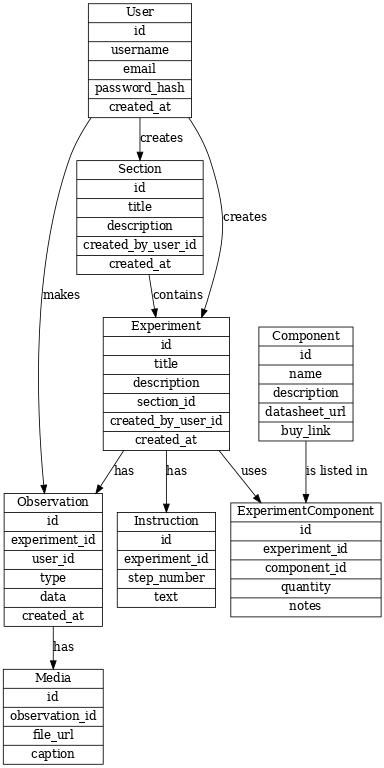

# MakeElectronicsNoteBook - Based on Make Electronics Third Edition

- Helps readers easily plan and document experiments given 
in the book. Also allows user to create there own experiments


## Entity-relationship-diagram (ERD)of database model


## Initial project structure

```bash
/your-app
│
├── /views               # EJS templates (sections, experiments, etc.)
├── /public              # CSS, client-side JS, images
├── /routes              # Route handlers (sections.js, experiments.js)
├── /controllers         # Business logic separated from routes
├── /models              # SQL queries or ORM logic
├── /db                  # DB connection setup
├── app.js               # Main server file
├── .env                 # Environment variables (DB creds, PORT)
└── package.json
```
```
```
```
```
```
```
```
```
```

## Tasks

1. set up project structure and database
